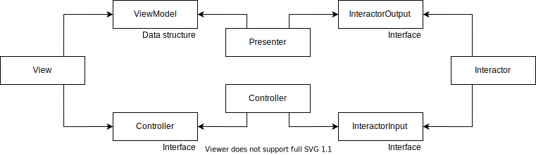

## Frontend Architectures

Project demonstrating various frontend architectures.

### Getting started

Install dependencies with:
```
yarn
```

Run project with:
```
yarn start
```

Run tests with:
```
yarn test
```

Build project with:
```
yarn build
```

### Architectures

#### Clean Architecture (as defined by Robert C. Martin)

**Path:**
```
src/module/login#clean-architecture
```

**Diagram:**


